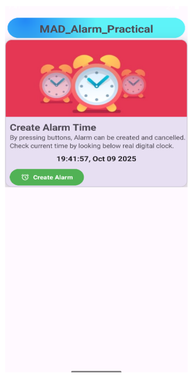
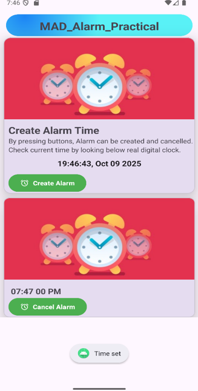
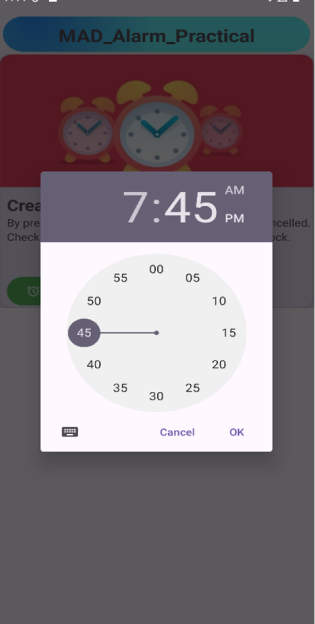

# Android Alarm Clock Application

A modern Android alarm clock application built with Kotlin that demonstrates the use of **AlarmManager**, **BroadcastReceiver**, **Services**, and **Material Design** components. Users can set custom alarms with a time picker and receive audio notifications.

---

## Features

-  Custom Alarm Creation with TimePicker
-  Real-time Clock Display (TextClock)
-  Alarm Sound Playback using MediaPlayer
-  Background Service for Alarm Handling
-  BroadcastReceiver for Alarm Triggers
-  Material Design UI with CardViews
-  Beautiful Gradient Background
-  Alarm Cancellation Feature
-  Edge-to-Edge Modern UI

---

## Screenshots

<div align="center">
  <table>
    <tr>
      <td align="center"><b>Main Screen</b></td>
      <td align="center"><b>Alarm Set</b></td>
      <td align="center"><b>Time Picker</b></td>
    </tr>
    <tr>
      <td></td>
      <td></td>
      <td></td>
    </tr>
  </table>
</div>

---

## Project Structure

```
app/
├── java/com/example/alarm/
│   ├── MainActivity.kt                  # Main UI and Alarm Logic
│   ├── AlarmBroadcastReceiver.kt       # Receives alarm broadcasts
│   └── AlarmService.kt                 # Handles alarm sound playback
│
├── res/
│   ├── layout/
│   │   └── activity_main.xml           # Main UI layout
│   ├── drawable/
│   │   ├── shape_rectangle.xml         # Gradient background
│   │   └── alarm_logo.xml              # Alarm icon
│   └── raw/
│       └── alarm.mp3                   # Alarm sound file
```

---

## Core Components

### 1. **MainActivity.kt**
- Displays real-time clock using `TextClock`
- Shows `TimePickerDialog` for alarm selection
- Sets exact alarms using `AlarmManager`
- Manages alarm card visibility
- Handles alarm cancellation

### 2. **AlarmBroadcastReceiver.kt**
- Receives alarm trigger broadcasts
- Starts/stops `AlarmService` based on action
- Acts as a bridge between AlarmManager and Service

### 3. **AlarmService.kt**
- Foreground service for alarm playback
- Plays alarm sound using `MediaPlayer`
- Manages audio lifecycle (play, stop, release)
- Shows toast notifications

### 4. **UI Components**
- **Material CardView** for alarm display
- **NestedScrollView** for scrollable content
- **Gradient Background** with radial gradient
- **MaterialButton** for actions

---

## Key Android Concepts

### AlarmManager
```kotlin
val alarmManager = getSystemService(ALARM_SERVICE) as AlarmManager
alarmManager.setExact(
    AlarmManager.RTC_WAKEUP, 
    millisTime, 
    pendingIntent
)
```

### BroadcastReceiver
```kotlin
class AlarmBroadcastReceiver : BroadcastReceiver() {
    override fun onReceive(context: Context, intent: Intent) {
        val action = intent.getStringExtra(ACTION_SERVICE)
        when (action) {
            "Start" -> context.startService(intentService)
            "Stop" -> context.stopService(intentService)
        }
    }
}
```

### Service with MediaPlayer
```kotlin
class AlarmService : Service() {
    private lateinit var mediaPlayer: MediaPlayer
    
    override fun onStartCommand(intent: Intent?, flags: Int, startId: Int): Int {
        mediaPlayer = MediaPlayer.create(this, R.raw.alarm)
        mediaPlayer.start()
        return START_STICKY
    }
}
```

---

## Prerequisites

- Android Studio (Hedgehog or later)
- Minimum SDK: **API 31** (Android 12)
- Target SDK: API 34 (Android 14)
- Kotlin 1.9+
- Gradle 8.0+

---

## Permissions Required

Add these permissions to your `AndroidManifest.xml`:

```xml
<!-- Required for exact alarms (Android 12+) -->
<uses-permission android:name="android.permission.SCHEDULE_EXACT_ALARM" />
<uses-permission android:name="android.permission.USE_EXACT_ALARM" />

<!-- For alarm notifications -->
<uses-permission android:name="android.permission.POST_NOTIFICATIONS" />

<!-- Wake device when alarm triggers -->
<uses-permission android:name="android.permission.WAKE_LOCK" />
```

### Declare Components

```xml
<application>
    <!-- Activities -->
    <activity android:name=".MainActivity" />
    
    <!-- Service -->
    <service
        android:name=".AlarmService"
        android:enabled="true"
        android:exported="false" />
    
    <!-- BroadcastReceiver -->
    <receiver
        android:name=".AlarmBroadcastReceiver"
        android:enabled="true"
        android:exported="false" />
</application>
```

---

## Installation

1. **Clone the repository:**
   ```bash
   git clone https://github.com/UjjWal557/android-alarm-app.git
   ```

2. Open the project in Android Studio

3. Add alarm sound file:
   - Place `alarm.mp3` in `res/raw/` directory

4. Sync Gradle files

5. Run the app on an emulator or physical device (API 31+)

---

## How to Use

1. **Launch the App** – View current time on the main screen

2. **Create Alarm**:
   - Tap the "Create Alarm" button
   - Select hours and minutes using the time picker
   - Confirm the time selection

3. **View Alarm** – A card appears showing the scheduled alarm time

4. **Stop Alarm**:
   - When alarm rings, tap "Stop Alarm" button
   - Or stop it from the alarm card before it triggers

5. **Permissions** – Grant exact alarm permission if prompted (Android 12+)

---

## Technical Implementation Details

### Exact Alarm Permission (Android 12+)
```kotlin
if (alarmManager.canScheduleExactAlarms()) {
    alarmManager.setExact(AlarmManager.RTC_WAKEUP, millisTime, pendingIntent)
} else {
    startActivity(Intent(Settings.ACTION_REQUEST_SCHEDULE_EXACT_ALARM))
}
```

### Time Formatting
```kotlin
textAlarmTime.text = SimpleDateFormat("hh:mm ss a", Locale.getDefault())
    .format(alarmCalendar.time)
```

### PendingIntent Flags
```kotlin
val pendingIntent = PendingIntent.getBroadcast(
    applicationContext,
    234324243,
    intent,
    PendingIntent.FLAG_IMMUTABLE  // Required for Android 12+
)
```

---

## Key Learning Outcomes

-  Working with **AlarmManager** for scheduling tasks
-  Implementing **BroadcastReceiver** for system events
-  Creating **Background Services** with MediaPlayer
-  Using **PendingIntent** for delayed actions
-  Handling **Runtime Permissions** (Android 12+)
-  **TimePickerDialog** for user input
-  **Material Design** components and theming
-  **Edge-to-Edge UI** with WindowInsets

---

## Dependencies

```gradle
dependencies {
    implementation "androidx.core:core-ktx:1.12.0"
    implementation "androidx.appcompat:appcompat:1.6.1"
    implementation "com.google.android.material:material:1.11.0"
    implementation "androidx.constraintlayout:constraintlayout:2.1.4"
}
```

---

## Gradle Configuration

```gradle
android {
    namespace = "com.example.alarm"
    compileSdk = 34

    defaultConfig {
        applicationId = "com.example.alarm"
        minSdk = 31  // Required for this implementation
        targetSdk = 34
        versionCode = 1
        versionName = "1.0"
    }

    compileOptions {
        sourceCompatibility = JavaVersion.VERSION_1_8
        targetCompatibility = JavaVersion.VERSION_1_8
    }

    kotlinOptions {
        jvmTarget = "1.8"
    }
}
```

---


## Troubleshooting

### Alarm not triggering?
- Check if exact alarm permission is granted
- Verify the alarm time is in the future
- Ensure battery optimization is disabled for the app

### No sound playing?
- Verify `alarm.mp3` exists in `res/raw/`
- Check device volume settings
- Ensure Do Not Disturb is disabled

### App crashes on Android 12+?
- Update `minSdk` to 31
- Use `PendingIntent.FLAG_IMMUTABLE`
- Request `SCHEDULE_EXACT_ALARM` permission

---


## Author

**Aashish Sah**  
- GitHub: [@aashishsah005](https://github.com/aashishsah005)
- Email: aashishsah005@gmail.com

---

## Acknowledgments

- Android Documentation for AlarmManager APIs
- Material Design Guidelines
- Stack Overflow Community
- Android Developers YouTube Channel

---

## Support

If you found this project helpful, please give it a ⭐ on GitHub!

---